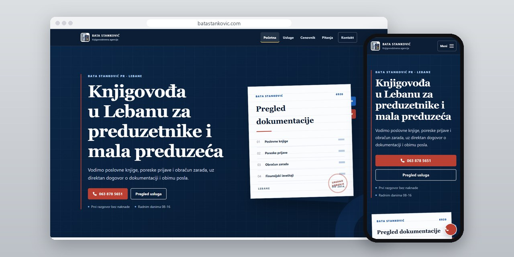
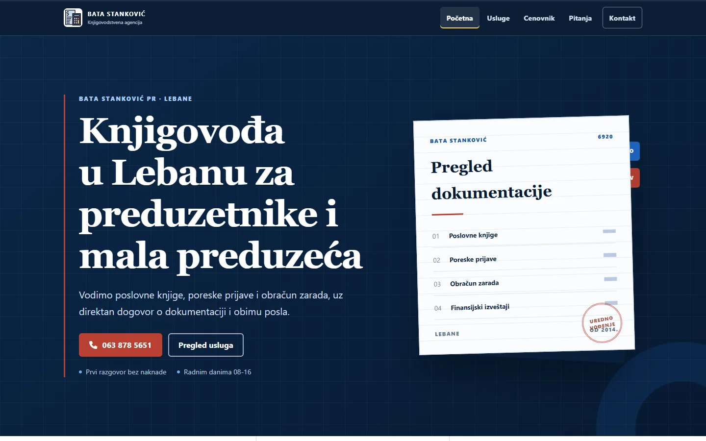
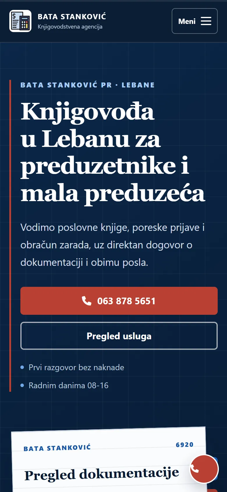
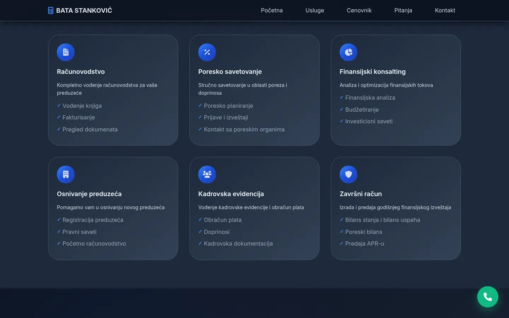
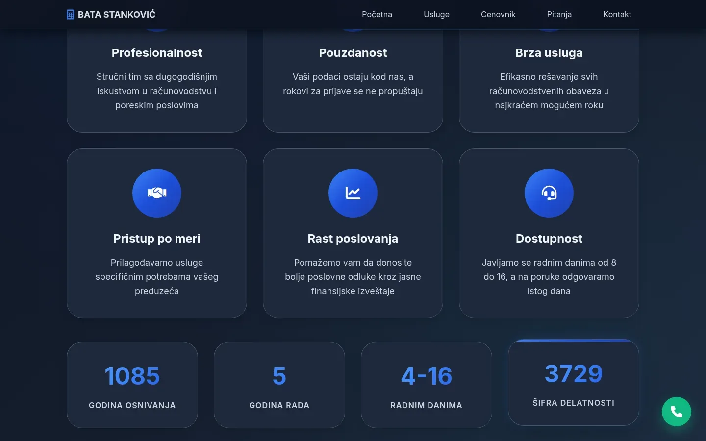

# Bata Stanković PR

Sajt za knjigovodstvenu agenciju iz Lebana, sa proverljivim podacima o firmi, kontakt formom koja stvarno stiže i stranama po vrsti klijenta.

**[batastankovic.com](https://batastankovic.com/)** · [Studija slučaja](https://svilenkovic.rs/radovi/bata-stankovic) · [English](README.md)

> [!NOTE]
> Klijentski projekat. Izvorni kod pripada klijentu i čuva se u privatnom repozitorijumu. Ova stranica opisuje šta sam uradio i kako.

<table>
  <tr><td><b>Klijent</b></td><td>Bata Stanković PR</td></tr>
  <tr><td><b>Delatnost</b></td><td>Knjigovodstvo i računovodstvo</td></tr>
  <tr><td><b>Lokacija</b></td><td>Lebane</td></tr>
  <tr><td><b>Vrsta</b></td><td>Sajt sa više strana</td></tr>
  <tr><td><b>Moj deo posla</b></td><td>Dizajn, izrada, SEO, hosting i održavanje</td></tr>
  <tr><td><b>Tehnologije</b></td><td>PHP 8.3, nginx, PHPMailer, Consent Mode v2</td></tr>
</table>

## O projektu

Bata Stanković PR od 2014. godine vodi knjige preduzetnicima, paušalcima i malim preduzećima iz Lebana i okoline. Ko traži knjigovođu, hoće dokaz da firma postoji, broj telefona i način da postavi jedno pitanje. U Jablaničkom okrugu skoro nijedna agencija nema pravi sajt, samo red u katalogu koji je neko drugi popunio, pa sajt na vrh stavlja registarske podatke koje klijent može da proveri.

Najvažniji nalaz bila je kontakt forma koja mesecima nije poslala nijednu poruku. Obavezna kućica za saglasnost bila je sakrivena sa `display: none`, pa kad validacija nije prošla, pregledač nije mogao da je fokusira i prekidao je slanje. Nije bilo ni mrežnog zahteva ni greške na ekranu, samo jedan red u konzoli koju niko ne otvara. Polje je sada obična, vidljiva kućica koja može da primi fokus, a sredio sam i put do sandučeta: sirove vrednosti za adresu za odgovor, zaštita od botova koja pri kvaru zatvara prolaz i prava poruka o grešci kad slanje ne uspe.

## Šta sam uradio

- Sa tri adrese na dvanaest: pregled usluga, pet strana po vrsti klijenta, cenovnik, strana za Leskovac i dvadeset pitanja i odgovora
- Oko devedeset komentara u kodu koji svaku tvrdnju o roku, stopi ili limitu vezuju za propis i datum provere
- Cenovnik bez izmišljenih iznosa: objašnjava od čega cena zavisi, a pretraživačima ne prijavljuje cene dok ih vlasnik ne upiše
- Revizija skinuta iz usluga, jer u Srbiji reviziju sme da nudi samo društvo sa dozvolom
- 'Knjigovodja' ispravljeno u 'knjigovođa' na 18 mesta, a strukturisani podaci dobili su pravo ime firme i ispravna polja za PDV i matični broj
- Skripta smanjena sa 31 na 20 KB, a statika se kešira godinu dana uz verziju u adresi

## Merenja

| | Performanse | Pristupačnost | Dobre prakse | SEO |
| :-- | :-: | :-: | :-: | :-: |
| Telefon | 96 | 100 | 100 | 100 |
| Desktop | 100 | 100 | 100 | 100 |

PageSpeed Insights, laboratorijsko merenje živog sajta, septembar 2026. Sigurnosna zaglavlja: 6 od 6. HTML validator: bez grešaka. axe provera pristupačnosti: bez prekršaja. Strukturisani podaci: `AccountingService`.

## Snimci ekrana

<table>
  <tr>
    <td width="68%" valign="top"></td>
    <td width="32%" valign="top"></td>
  </tr>
</table>

Sekcija "Naše usluge": šest usluga sa nabrojanim stavkama

Sekcija "Zašto odabrati nas": dostupnost radnim danima 08-16, isto kao u podacima za pretraživače

---

Izrada: [D. Svilenković](https://svilenkovic.rs).
